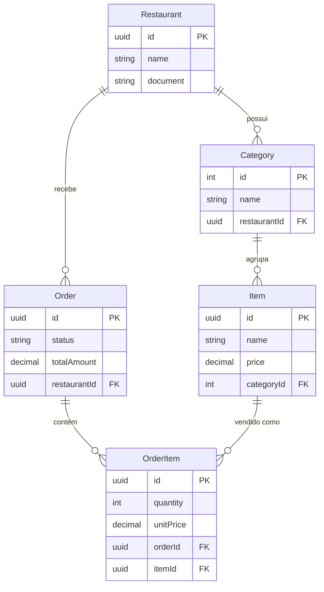

### Restauranto


An app for simplifing managment of small food businesses

#### ⚙️ Running the App
You can run the app in development by using (on the root folder):

```shell
docker compose up -d
```

There is a need to setup environment variables at backend/.env, namely:

- `POSTGRES_USER`
- `POSTGRES_PASSWORD`
- `POSTGRES_DB`
- `DATABASE_URL`

#### 💽 Current Data Model
